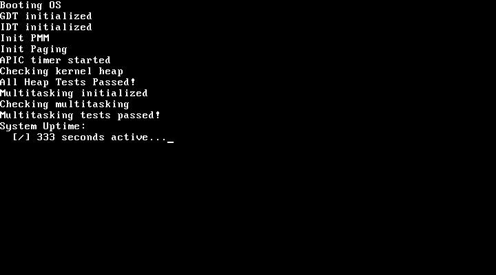

# KallarOS

A hobby x86 32-bit operating system built from scratch in C and assembly. The goal of this project is to get an even deeper understanding of operating system development, low-level programming and most importantly to have fun! :)

Currently, the kernel successfully boots into a fully paged virtual memory environment, complete with physical/virtual memory allocators, hardware interrupts (IDT/PIC), an APIC system timer, and a basic VGA text-mode driver.

The OS now supports multitasking with a MLFQ scheduler. The next steps are to implement a disk driver, a file system and user space with system calls.



The goal of this project is to be able to run actual programs, like the glorious [`sl`](https://github.com/mtoyoda/sl), alongside the less superior `ls` :)

## Getting Started

### Prerequisites

If you're on a debian-based system, simply run `build_toolchain.sh` to build the whole toolchain, including the cross-compiler.

It runs on Binutils(2.41), GCC(13.2.0) and qemu-system-i386.

### Building and Running

Once the toolchain is built, use the Makefile to compile the kernel and launch it in QEMU:

- `make` - Builds the kernel and creates a bootable ISO image.
- `make run` - Builds the kernel and runs it in QEMU.
- `make clean` - Cleans up build artifacts.
- `make debug` - Boots the OS paused, waiting for a GDB connection on port 1234

### Debugging

You can use the `make debug` command to boot the OS in a paused state, allowing you to connect a GDB session for debugging.

In addition you can also use println-style debugging by using the debug header, which provides a macro to enable or disable printing, using pr.

For example:

```c
#define PRINT 1
#include "util/debug.h"

void some_function() {
    pr("This will only print if PRINT is set to 1");
}
```

### Roadmap

- [x] Bootloader
- [x] VGA Text Mode Driver
- [x] GDT (Global Descriptor Table)
- [x] IDT & PIC (Hardware Interrupts)
- [x] Keyboard Driver
- [x] Automated Cross-Compiler Toolchain
- [x] Basic Error Printing
- [x] The APIC (System timer & heartbeat)
- [x] Memory Management (Physical RAM & Paging)
- [x] Kernel Heap (`kmalloc` & `kfree`)
- [x] Multitasking (MLFQ Scheduler & mutexes)
- [ ] Disk Driver (ATA)
- [ ] File System (FAT32/ext2)
- [ ] User Space (Ring 3) & System Calls
- [ ] ELF Loader (Running actual programs!)
